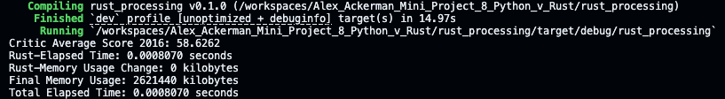
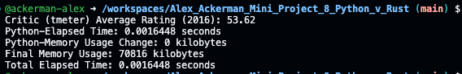

[](https://github.com/nogibjj/Alex_Ackerman_Mini_Project_8_Python_v_Rust/actions/workflows/CI.yml)

[](https://github.com/nogibjj/Alex_Ackerman_Mini_Project_8_Python_v_Rust/actions/workflows/rust_CI.yml)

# Alex_Ackerman_Mini_Project_8_Python_v_Rust

## Mini Project 8: Comparing Python and Rust for Data Processing 

## Requirements
* Take an existing Python script for data processing
* Rewrite it in Rust
* Highlight improvements in speed and resource usage

## Dataset
The dataset used for this project can be found at [this repository](https://github.com/mircealex/Movie_ratings_2016_17?tab=readme-ov-file).

Per the source repository:
`movie_ratings_16_17.csv` contains movie ratings data for 214 of the most popular movies (with a significant number of votes) released in 2016 and 2017. As of March 22, 2017, the ratings were up to date. Significant changes should be expected mostly for movies released in 2017.

## Task Performed
The Python and Rust scripts were written to take in `movie_ratings_16_17.csv` and calculate the average rating for a given movie critic site. The possible critic sites were Metacritic (metascore), IMDB (imdb), Rotten Tomatoes (tmeter), Fandango (fandango), and the Audience Score (audience). The default critic site and values which this comparison was perform was set as Rotten Tomatoes. This input can be easily changed in Python by passing in a different column name and can be changed in Rust by changing the column number that is analyzed. 

## Code Walkthrough
#### Set up the environment to build the code in both Python and Rust.
__`Rust`__
  - Create `main.rs` and `lib.rs` files in the `src` directory for Rust to execute specific functions, __calculating the Critic Average Score, measuring data processing time, and monitoring memory usage__.
  - `main.rs`
    ```Rust
    use std::time::Instant;
    use psutil::process::Process;
    use csv::ReaderBuilder;
    use std::error::Error;
    use std::fs::File;

    fn calculate_time_memory(path: &str) -> (i64, f64) {
        // Record the start time
        let start_time = Instant::now();

        // Measure the initial resource usage
        let process = Process::new(std::process::id());
        let start_mem_usage = process.as_ref().expect("Failed to create process").memory_info().expect("Failed to get memory info").rss();

        // Calculate the average
        let _average_result = average(path);

        // Record the end time
        let end_time = Instant::now();

        // Measure the final resource usage
        let end_mem_usage = process.as_ref().expect("Failed to create process").memory_info().expect("Failed to get memory info").rss();

        // Calculate the elapsed time
        let elapsed_time = end_time.duration_since(start_time).as_secs_f64();

        println!("Rust-Elapsed Time: {:.7} seconds", elapsed_time);
        println!("Rust-Memory Usage Change: {} kilobytes", end_mem_usage - start_mem_usage);

        (end_mem_usage as i64, elapsed_time)
    }

    fn average(path: &str) -> Result<f64, Box<dyn Error>> {
        let file = File::open(path)?;
        let mut rdr = ReaderBuilder::new().delimiter(b',').from_reader(file);

        let mut sum = 0.0;
        let mut count = 0;

        for result in rdr.records() {
            let record = result?;
            if let Some(weight) = record.get(5) {
                if let Ok(parsed_weight) = weight.parse::<f64>() {
                    sum += parsed_weight;
                    count += 1;
                }
            }
        }

        if count == 0 {
            return Err("No data found".into());
        }

        Ok(sum / count as f64)
    }

    fn main() {
        let path = "/workspaces/Alex_Ackerman_Mini_Project_8_Python_v_Rust/data/movie_ratings_16_17.csv"; // Updated with the actual CSV file path

        match average(path) {
            Ok(avg) => println!("Critic Average Score 2016: {:.4}", avg),
            Err(err) => eprintln!("Error: {}", err),
        }

        let (end_mem_usage, elapsed_time) = calculate_time_memory(path);

        println!("Final Memory Usage: {} kilobytes", end_mem_usage);
        println!("Total Elapsed Time: {:.7} seconds", elapsed_time);
    }

    ```
  - Create a `Cargo.toml` file to execute the Rust files and install dependencies.</br>
  - `Cargo.toml` </br>
    ```
    [package]
    name = "rust_processing"
    version = "0.1.0"
    edition = "2021"

    [dependencies]
    csv = "1.3.0"
    psutil = "3.3.0"
    rand = "0.8.5"
    serde = "1.0.213"
    serde_derive = "1.0.213"
    sysinfo = "0.32.0"
    time = "0.3.36"

    ```

__`Python`__
  - Create `__init__.py` and `average.py` files in the `library` directory for Python to execute specific functions, calculating the critic average score, measuring processing time, and monitoring memory usage.
  - `average.py`
    ```Python
    import pandas as pd
    import time
    import resource


    def average(path, critic_site="tmeter"):
        """
        Calculates Average Critic Score From Movie Data
        critic_site can be metascore, imdb, tmeter, audience, fandango
        """
        movie_data = pd.read_csv(path)

        critic_avg_score = round(movie_data[critic_site].mean(), 2)
        return critic_avg_score


    def calculate_time_memory(path):
        # Record the start time
        start_time = time.time()

        # Measure the initial resource usage
        start_mem_usage = resource.getrusage(resource.RUSAGE_SELF).ru_maxrss

        # Calculate the average
        average(path)

        # Record the end time
        end_time = time.time()

        # Calculate the elapsed time
        elapsed_time = end_time - start_time

        # Measure the final resource usage
        end_mem_usage = resource.getrusage(resource.RUSAGE_SELF).ru_maxrss

        print(f"Python-Elapsed Time: {elapsed_time:.7f} seconds")
        print(f"Python-Memory Usage Change: {end_mem_usage - start_mem_usage} kilobytes")

        return end_mem_usage, elapsed_time

    ```
  - Create `main.py` and `test_main.py` to ensure that `average.py` runs correctly and to perform testing.
  - `main.py`
    ```Python
    from library.average import average, calculate_time_memory
    from library.average import average, calculate_time_memory

    data_path = "data/movie_ratings_16_17.csv"

    if __name__ == "__main__":
        data_path = "data/movie_ratings_16_17.csv"

        # critic_site can be metascore, imdb, tmeter, audience, fandango
        critic_site = "tmeter"

        critic_avg_score = average(data_path, critic_site)
        print(f"Critic ({critic_site}) Average Rating (2016): {critic_avg_score:.2f}")

        end_mem_usage, elapsed_time = calculate_time_memory(data_path)

        print(f"Final Memory Usage: {end_mem_usage} kilobytes")
        print(f"Total Elapsed Time: {elapsed_time:.7f} seconds")

    ```
  - `test_main.py`
    ```Python
    from library.average import average, calculate_time_memory

    data_path = "data/movie_ratings_16_17.csv"

    def test_average():
        result = average("data/movie_ratings_16_17.csv")
        expected_result = 53.62

        assert result == expected_result, "Test has failed."


    def test_calculate_time_memory():
        result = calculate_time_memory("data/movie_ratings_16_17.csv")

        assert result is not None, "Test has failed."


    if __name__ == "__main__":
        test_average()
        test_calculate_time_memory()

    ```

##  Results
#### Calculate the Critic Average Score, measure the time used, and monitor memory usage.
* `Rust` </br>
  </br>
* `Python` </br>
  </br>
  
|                    |        Rust       |       Python      |       Performance       |
|:------------------:|:-----------------:|:-----------------:|:-----------------------:|
|  Critic Average Score 2016 |       58.62    |       58.62    | The values are the same |
|    Elapsed Time    | 0.0008070 seconds | 0.0014596 seconds |        Rust x 1.809 faster         |
|    Memory Usage    |    0 kilobytes    |   0 kilobytes  |          The values are the same        |
| Total Elapsed Time | 0.000807 seconds | 0.0014596 seconds |         Rust x 1.809 faster         |
| Final Memory Usage | 2621440 kilobytes |  70536 kilobytes  |         Rust x 36.98 more memory        |


Based on the results, Rust generally executes functions faster than Python but used significantly more memory. This result is somewhat unexpected as Rust is supposed to be faster and use less memory. It is highly likely that given my limited knowledge of Rust my program runs suboptimally, however, it is possible that Python was better on memory given that pandas and numpy are built specifically for data processing and are highly optimized packages themselves. Every language has it's strengths and weaknesses and performance will vary depending the specific use case and implementation.
